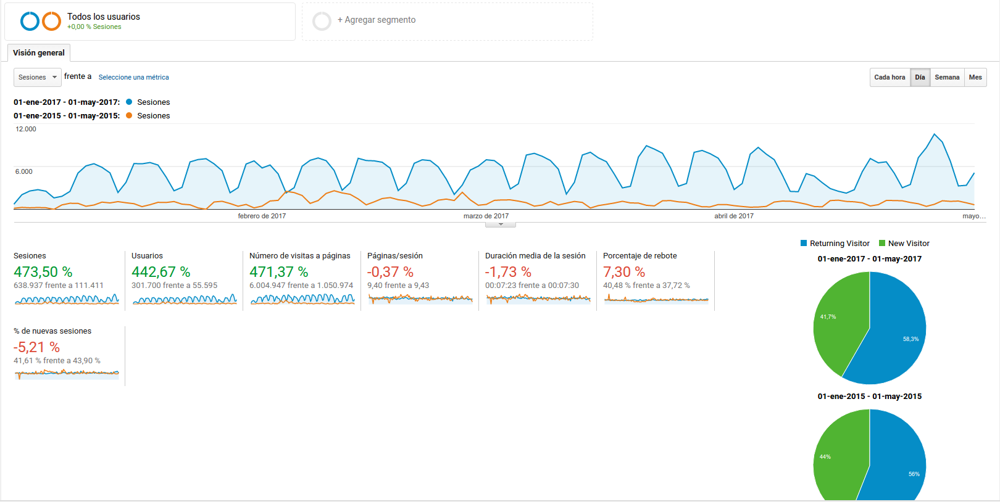

# Arasaac

## ¿Qué es Arasaac?
- Es una webapp, no una "página web"
- Aplicación LAMP con arquitectura tradicional
- Arquitectura vértical
- Gran uso de procesador (gestión de imágenes)
- "Lógica de negocio" reducida
- Gran uso de redes sociales 
- Localización

# ¿Es necesario el cambio?
-  

## ¿Cómo será el nuevo Arasaac?
- Base de datos no relacional
- Servidor y cliente con JavaScript (node.js/python y React)
- Localización: 
  - Uso de [crowdin](https://crowdin.com/) para gestión de traducciones
  - Uso de la API de traducción de Microsoft Windows Azure
- Imágenes mediante SVG
- API REST documentada mediante [swagger](http://swagger.io/)

## Otras consideraciones
- Replica rápida entre entornos de desarrollo y producción
- Arquitectura horizontal 
- Medios económicos límitados
- Una sola máquina física en producción:
  - Debemos virtualizar para evitar el *dependency hell*
  - Nuestra CPU y RAM es limitada
- VMWare no nos sirve, Docker sí

## Migración de Arasaac
- Nuestro desarrollo es lento
- La máquina actual de Arasaac estaba en un estado "inestable"
- Nuestra nueva máquina de producción estaba ociosa
- No hay redundancia (al menos en base de datos)

## Cambio de hardware 
  - Pasamos de tres máquinas muy potentes (2 Apache + 1 Mysql) a una sola
  - Pasamos de 48GBytes de RAM a 4GBytes
  - Pasamos a tener menos de un 25% de CPU
  - La nueva máquina estaba pensada para una API Rest, cargando todo el procesamiento en cliente...

## Tareas para hacer la migración
- Replicar la instalación previa (no hay documentación)
  - Librerías php, mysql
  - Prueba de funcionamiento
- Documentar despliegue (Docker)

## Optimización de Arasaac
- Es necesario
- No queremos tocar el código PHP :-)
- ¿Servicio Caché?
- ¿Cambio de versiones? 
  - Pruebas de funcionamiento + estrés
  - Necesitamos Docker :-)
