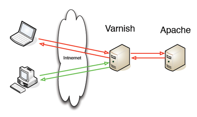
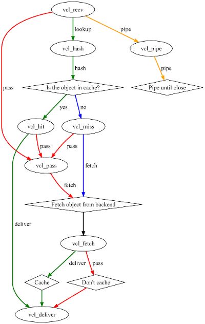

# Rendimiento sitio web


## Instalación herramientas testeo
- Vamos a testear el rendimiento de nuestro servidor web.
- Las opciones más habituales son: 
  - [ab (Apache benchmark)](https://httpd.apache.org/docs/2.4/programs/ab.html) 
  - [Siege](https://www.joedog.org/siege-home/)

```
apt-get install siege
```


## Instalación herramientas monitorización
- Usaremos [Datadog](http://www.datadoghq.com)
- Registrate y sigue los pasos para instalar el agente
- La cuenta es gratuita para un máximo de 5 hosts y con un histórico de 24h


## Características de nuestra máquina

- Haremos nuestros tests con una máquina con un solo procesador y 2GBytes de RAM

```
cat /proc/cpuinfo
cat /proc/meminfo
```


## Simulación uso procesador

- Arasaac es una aplicación con gran uso de procesador:
  - Generación de PDF
  - Modificación de imágenes
  - ....


- Lo simularemos con el siguiente script *factorial.php* que colgaremos en web1 y web2:

```
<?php
   $numero = $_GET["numero"];
for ($i=0 ; $i<100000 ; $i++) {
   $resultado = fact($numero);
}
echo $resultado;
function fact($num)
{
    $res = 1;
    for ($n = $num; $n >= 1; $n--)
        $res = $res*$n;
    return $res;
}
?>
```


## Uso de siege benchmark

```
siege -c100 -t30S www.web1.com/factorial.php?numero=20
siege -c100 -t30S www.web2.com/factorial.php?numero=20
```

- c es el número de accesos concurrentes que queremos
- t es el tiempo en segundos que va a durar la carga


## Análisis de resultados

- ¿Cuántas peticiones concurrentes somos capaces de aceptar con un response time aceptable?
- ¿Cuántas tiene o tendrá nuestro sitio web?
- Mayor concurrencia no es igual a mayor desempeño
- Cuanto mayor throughput o transaction rate mejor
- ¿Hay failed transactions?


## Uso de un servidor caché

  

- Añadimos Varnish (web1 irá por varnish, web2 no).
- Comprobemos el diferente desempeño de web1 y web2


## Configuración servidor caché

- Utilizamos una imagen ya preparada
- Nuestro servidor nginx servirá a:
  - web2 directamente
  - web1 por medio de varnish


- Fichero docker-compose.yml:

```
version: '3'
services:
  nginx-proxy:
    image: jwilder/nginx-proxy
    container_name: nginx-proxy
    ports:
      - "80:80"
    volumes:
      - /var/run/docker.sock:/tmp/docker.sock:ro
  varnish:
    image: eeacms/varnish
    environment:
      - VIRTUAL_HOST=web1.com,www.web1.com
      - BACKENDS=web1
      - BACKENDS_PORT=80
  web1:
    # image: php:5.6-apache
    build: ./web1
    container_name: web1
    volumes:
      - ./data-web1:/var/www/html
  web2:
    image: php:5.6-apache
    container_name: web2
    volumes:
      - ./data-web2:/var/www/html
    environment:
      - VIRTUAL_HOST=web2.com,www.web2.com
  db:
    hostname: db
    image: mysql:5.5
    container_name: db
    volumes:
      - ./data-db:/var/lib/mysql
      - ./init-db:/docker-entrypoint-initdb.d
    environment:
      - MYSQL_ROOT_PASSWORD=password
      - MYSQL_DATABASE=demo
```


## Pruebas de uso
- Ejecuta siege de nuevo y comprueba resultados
- Para web1, ¿se sigue sirviendo el contenido?
- Reinicia varnish, ¿y ahora se sirve algo o tenemos un error 503 en Varnish? :-)


## Parametrizar varnish
- La configuración de varnish se hace mediante ficheros vcl que luego se compilan a C para su ejecución
- Podríamos cambiar la imagen a una propia:

```
FROM eeacms/varnish
COPY varnish.vcl /etc/varnish/conf.d/
```

- Y añadir un fichero varnish.vcl en base a [templates ya definidas](https://github.com/mattiasgeniar/varnish-4.0-configuration-templates)


  


## Consideraciones
- Si el código php nos da un error...
  -  Lo corregimos
  -  Purgamos la caché
- ¿Cuanta espacio reservamos para la caché?
  - ¿En RAM?
  - ¿En disco?


## loadaverage
- El loadaverage de la CPU no debería ser superior al total de procesadores
  - Utiliza top / htop para comprobarlo