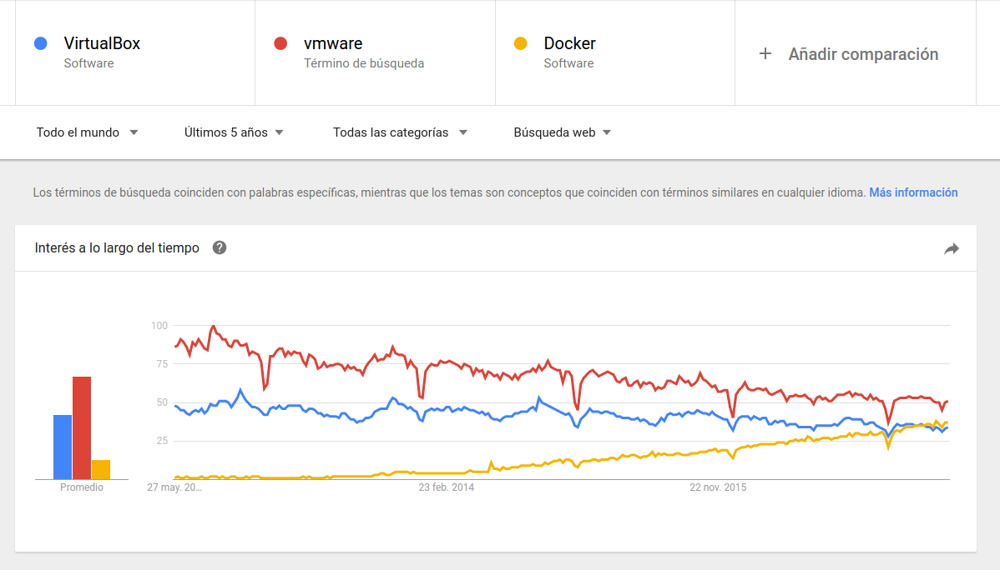
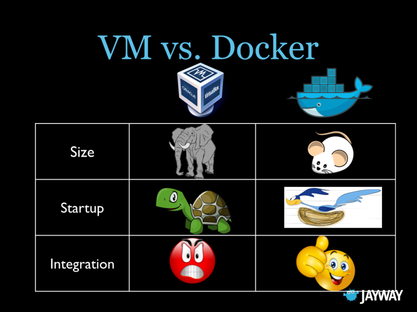

# Docker


## ¿Qué es docker?

- Un sistema de virtualización que cada vez se usa más:
    

- Más ligero:
  - Un solo SO para todos nuestros contenedores (máquinas virtuales)
   

- Y muchas más cosas:
  

- Más info: 
  - https://docs.docker.com/
  - http://www.formandome.es/linux/docker/


## Instalación
- Dos versiones: 
  - CE (Community edition)
  - EE (Enterprise edition)

- Ya tenemos instalada la versión CE en nuestra máquina virtual
https://docs.docker.com/engine/installation/linux/ubuntu/


## docker-compose
- Gestión de varios contenedores (servicios) a la vez
- [Instalación](https://docs.docker.com/compose/install/)

```
curl -L https://github.com/docker/compose/releases/download/1.13.0/docker-compose-`uname -s`-`uname -m` > /usr/local/bin/docker-compose
sudo chmod +x /usr/local/bin/docker-compose
docker-compose --version
```


## Creación de nuestro proyecto
- Trabajaremos con usuario root por comodidad
```
$ sudo su
# cd
# mkdir demo
# cd demo
```


## Búscamos nuestra imagen para un servidor web

- [Vía web](https://hub.docker.com/)

- Vía consola

```
docker search php
```


## Configuración:

- Fichero docker-compose.yml:

```
version: '3'
services:
  web1:
    image: php:5.6-apache
    container_name: web1
```


## Arranque del contenedor

```
docker-compose up -d
```


## Comprobar estado

```
docker-compose ps

➜  demo docker-compose ps
Name              Command               State   Ports  
------------------------------------------------------
web1   docker-php-entrypoint apac ...   Up      80/tcp 
```


## Acceso al contenedor
- No podemos acceder: necesitamos algún tipo de redirección desde el host
- Tendremos que añadir un mapeo de puertos en el fichero docker-compose.yml y reiniciar el servicio
- Internamente realizará un prerouting mediante iptables


- Fichero docker-compose.yml

```
version: '3'
services:
  web1:
    image: php:5.6-apache
    container_name: web1
    ports:
      - "8000:80"
```


- Parar y arrancar el servicio:

```
docker-compose down

➜  demo docker-compose up -d
Creating network "demo_default" with the default driver
Creating web1
➜  demo docker-compose ps
Name              Command               State          Ports         
--------------------------------------------------------------------
web1   docker-php-entrypoint apac ...   Up      0.0.0.0:8000->80/tcp 
```


- Si ahora vamos a http://localhost:8000
  - No sirve nada
- Podemos entrar al contenedor, ejecutando un comando sobre ella (un shell bash):
```
docker-compose exec web1 bash
cd /var/www/html
```


- Habría que añadir al menos un fichero
- Lo más cómodo será mapeando directorios ya que nuestro contenedor ¡no tiene ni el paquete vi!

```
mkdir data-web1
echo "<?php phpinfo(); ?>" >data-web1/index.php
cd ..
```


- Añadimos el mapeo en nuestro fichero de configuración:

```
version: '3'
services:
  web1:
    image: php:5.6-apache
    container_name: web1
    volumes:
      - ./data-web1:/var/www/html
    ports:
      - "8000:80"
```


Para comprobar el funcionamiento, creamos un fichero index.php en nuestro directorio data-web1 con el siguiente contenido:
```
<?php phpinfo(); ?>
```


- Comprobamos al ejecutar http://localhost:8000 que el fichero se carga... sin embargo no tenemos las extensiones de bbdd:

  - ext/mysql (not recommended)
  - ext/mysqli
  - PDO_MySQL


## Acceso a base de datos

- Necesitamos los siguientes componentes:
  - Una base de datos
    - A partir de una nueva imagen
    - Filosofía docker: *one container, one service* 
  - Configurar nuestro PHP con las extensiones correspondientes


## Customizar imagen php
- La imagen de PHP que tenemos es básica, necesitamos otra nueva:
  - Podemos crear una imagen de 0
  - Instalar componentes adicionales a partir de la anterior (mejor)
    - Crear un directorio para nuestra imagen
    -  Crear un fichero Dockerfile con las instrucciones para generar nuestra imagen.


``` 
mkdir web1
cd web1

cat Dockerfile 
FROM php:5.6-apache
RUN docker-php-ext-install mysqli
```


- Cambiamos la etiqueta **image** por la etiqueta **build** en el docker-compose.yml

```
version: '3'
services:
  web1:
    build: ./web1
    container_name: web1
    volumes:
      - ./data-web1:/var/www/html
    ports:
      - "8000:80"
```


- Reiniciamos:

```
docker-compose down
docker-compose up -d
```


## Imagen para la base de datos:

- Otra vez como antes...
  - Vía consola:

  ```
docker search mysql
  ```

  - [Vía web](https://hub.docker.com/)


## Un ejemplo (¡respeta tabulaciones!):

```
  db:
    hostname: db
    image: mysql:5.5
    container_name: db
    volumes:
      - ./data-db:/var/lib/mysql
      - ./init-db:/docker-entrypoint-initdb.d
    environment:
      - MYSQL_ROOT_PASSWORD=password
      - MYSQL_DATABASE=demo
```


- Consideraciones:
  - Pasamos variables de entorno según la documentación de la imagen
  - El nombre del host
  - Un volumen para mapear los ficheros de la base de datos y otro para inicializarla (a partir de un fichero sql)


- Descarga el fichero con los datos:

```
mkdir init-db
cd init-db
wget https://raw.githubusercontent.com/juanda99/taller-docker-php-varnish/master/demo.sql
cd ..
```

- Reinicia el servicio completo

```
docker-compose down
docker-compose up -d
```


- Comprobamos que se han instalado bien los datos

```
docker-compose exec db bash
mysql -uroot -ppassword
show databases
use demo
show tables
....
```


- Vamos a probarlo "en real" cambiando nuestro fichero index.php

```
<?php
$servername = "db";
$username = "root";
$password = "password";
$dbname = "demo";

// Create connection
$conn = new mysqli($servername, $username, $password, $dbname);
// Check connection
if ($conn->connect_error) {
    die("Connection failed: " . $conn->connect_error);
} 

$sql = "SELECT name, continent, region FROM country";
$result = $conn->query($sql);

if ($result->num_rows > 0) {
    // output data of each row
    while($row = $result->fetch_assoc()) {
        echo "País: " . $row["name"]. " - Continente: " . $row["continent"]. " -Región: " . $row["region"]. "<br>";
    }
} else {
    echo "0 results";
}
$conn->close();
?>
```


## Proxy inverso

- ¿Y si tenemos más de un sitio web?
  - No pueden ir todos por el 80
  - Necesitamos un proxy inverso (virtual hosts en Apache) que redireccione:

  ```
  docker search proxy
  ```


## Configuración de DNS

- A falta de DNS, utilizaremos el fichero **/etc/hosts**
- Añadimos la url del nuevo sitio para que se resuelva en local

```
127.0.0.1       web1.com        www.web1.com
```


## Configuración servicio

- Modificamos el fichero docker-compose.yml (la redirección de puertos la ponemos en el proxy)

```
version: '3'
services:
  nginx-proxy:
    image: jwilder/nginx-proxy
    container_name: nginx-proxy
    ports:
      - "80:80"
    volumes:
      - /var/run/docker.sock:/tmp/docker.sock:ro
  web1:
    build: ./web1
    container_name: web1
    volumes:
      - ./data-web1:/var/www/html
    environment:
      - VIRTUAL_HOST=web1.com,www.web1.com
  db:
    hostname: db
    image: mysql:5.5
    container_name: db
    volumes:
      - ./data-db:/var/lib/mysql
      - ./init-db:/docker-entrypoint-initdb.d
    environment:
      - MYSQL_ROOT_PASSWORD=password
      - MYSQL_DATABASE=demo
```


## Comprobaciones
- Probamos que se accede a *www.web1.com*
- Añadamos otra segunda web *www.web2.com*
  - Se repiten los pasos anteriores


- docker-compose.yml:

```
  web2:
    image: php:5.6-apache
    container_name: web2
    volumes:
      - ./data-web2:/var/www/html
    environment:
      - VIRTUAL_HOST=web2.com,www.web2.com
```


- registro a /etc/hosts:

```
127.0.0.1       web2.com        www.web2.com
```


- Directorio para los ficheros de la web

```
mkdir data-web2
cd data-web2 
echo "<?php phpinfo(); ?>" >index.php
```


- Arranque del servicio:

```
$ docker-compose up -d web2   
```


- Comprobamos:

```
$ docker-compose ps        

   Name                  Command               State         Ports        
-------------------------------------------------------------------------
db            docker-entrypoint.sh mysqld      Up      3306/tcp           
nginx-proxy   /app/docker-entrypoint.sh  ...   Up      0.0.0.0:80->80/tcp 
web1          docker-php-entrypoint apac ...   Up      80/tcp             
web2          docker-php-entrypoint apac ...   Up      80/tcp   
```


- Observa que ha funcionado directamente sin reinciar el servidor proxy :-)


## Ejercicios
- Añadir un servicio phpmyadmin
- Añadir un contenedor para backups de base de datos
- Añadir un servicio de ssh enjaulado


## Soluciones
- Mira la configuración de los contenedores en en repositorio de [DockerizePHPApp](https://github.com/Arasaac/dockerizePHPApp)
- Es útil saber algo de bash