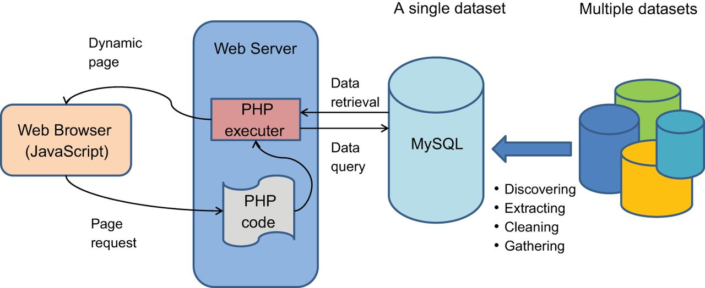
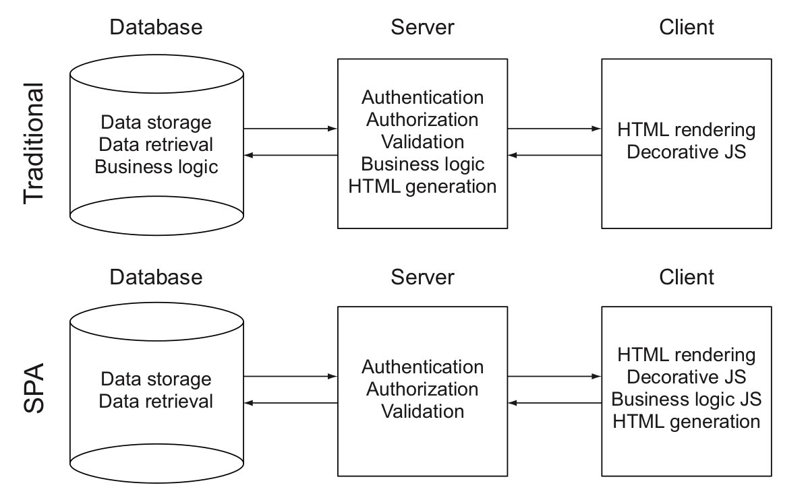
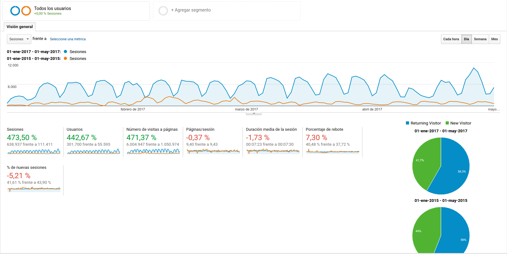

# Introducción al desarrollo Web


## Webapp vs páginas web
- ¿A medida?
- ¿Uso de software existente?
  - Moodle, Prestashop, Joomla, Wordpress...
- ¿Uso de frameworks?
  - Laravel, Django, Angular, React...


## Arquitecturas sistemas LAMP

- Normalmente usan programación web tradicional
  - Se pide una página al servidor
  - El servidor la envía
  - El navegador la renderiza





## Programación moderna

- Aplicaciones de una sola página (SPA).
- Se sirven todas las páginas a la vez:
  - Se renderizan directamente desde el navegador
  - La navegación entre páginas es inmediata
- El servidor provee una **API** que se consulta de modo asíncrono
- Tiempo de respuesta muy rápido (ideal para aplicaciones de escritorio)


## Áreas de desarrollo

 


## Lenguaje en servidor

- El lenguaje en el servidor es variable: 
  - nodeJS
  - Ruby
  - Python
  - PHP
  - ...


## Lenguaje en cliente

- Siempre es JavaScript
  - A veces se utilizan otros lenguajes (TypeScript, Elm...) y se compilan posteriormente a JavaScript
  - Otra opción es usar el nuevo estándar de JavaScript : 
    - ES6 y ES7 
    - Usar un transpiler: Babel, "el nuevo jQuery"
  - Automatizamos todo mediante task managers: Grunt, Gulp, Webpack...


## Frameworks de JavaScript
- Los frameworks de JavaScript más usados son
  - React
  - Angular
  - Vue (lo usa el framework de PHP Laravel)


     


# Nuestro proyecto: Arasaac


## ¿Qué es Arasaac?
- Es una webapp, no una "página web"
- Aplicación LAMP con arquitectura tradicional
- Arquitectura vértical
- Gran uso de procesador (gestión de imágenes)
- "Lógica de negocio" reducida
- Gran uso de redes sociales 
- Localización


# ¿Es necesario el cambio?
-  


## ¿Cómo será el nuevo Arasaac?
- Base de datos no relacional
- Servidor y cliente en JavaScript (node.js y React)
- Localización: 
  - Uso de [crowdin](https://crowdin.com/) para gestión de traducciones
  - Uso de la API de traducción de Microsoft Azure
- Imágenes mediante SVG
- API REST documentada mediante [swagger](http://swagger.io/)


## Otras consideraciones
- Replica rápida entre entornos de desarrollo y producción
- Arquitectura horizontal 
- Medios económicos límitados
- Una sola máquina física en producción:
  - Debemos virtualizar para evitar el *dependency hell*
  - Nuestra CPU y RAM es limitada
- VMWare no nos sirve, Docker sí


## ¿Qué es docker?

- Un sistema de virtualización que cada vez se usa más:
    

- Más ligero:
  - Un solo SO para todos nuestros contenedores (máquinas virtuales)
   

- Y muchas más cosas:
  

- Más info: 
  - https://docs.docker.com/
  - http://www.formandome.es/linux/docker/


## Migración de Arasaac
- Nuestro desarrollo es lento
- La máquina actual de Arasaac estaba en un estado "inestable"
- Nuestra nueva máquina de producción estaba ociosa
- No hay redundancia (al menos en base de datos)


## Cambio de hardware 
  - Pasamos de tres máquinas muy potentes (2 Apache + 1 Mysql) a una sola
  - Pasamos de 48GBytes de RAM a 4GBytes
  - Pasamos a tener menos de un 25% de CPU
  - La nueva máquina estaba pensada para una API Rest, cargando todo el procesamiento en cliente...


## Tareas para hacer la migración
- Replicar la instalación previa (no hay documentación)
  - Librerías php, mysql
  - Prueba de funcionamiento
- Documentar despliegue (Docker)


## Optimización de Arasaac
- Es necesario
- No queremos tocar el código PHP :-)
- ¿Servicio Caché?
- ¿Cambio de versiones? 
  - Pruebas de funcionamiento + estrés
  - Necesitamos Docker :-)


# Docker


## Instalación
- Dos versiones: 
  - CE (Community edition)
  - EE (Enterprise edition)

- Ya tenemos instalada la versión CE en nuestra máquina virtual
https://docs.docker.com/engine/installation/linux/ubuntu/


## docker-compose
- Gestión de varios contenedores (servicios) a la vez
- [Instalación](https://docs.docker.com/compose/install/):
```
curl -L https://github.com/docker/compose/releases/download/1.13.0/docker-compose-`uname -s`-`uname -m` > /usr/local/bin/docker-compose
sudo chmod +x /usr/local/bin/docker-compose
docker-compose --version
```


## Creación de nuestro proyecto
- Trabajaremos con usuario root por comodidad
```
$ sudo su
# cd
# mkdir demo
#cd demo
```


## Búscamos nuestra imagen para un servidor web

- [Vía web](https://hub.docker.com/)

- Vía consola

```
docker search php
```


## Configuración:

- Fichero docker-compose.yml:

```
version: '3'
services:
  web1:
    image: php:5.6-apache
    container_name: web1
```


- Levantamos el servicio:
```
docker-compose up -d
```


- Comprobamos su ejecución: 

```
docker-compose ps

➜  demo docker-compose ps
Name              Command               State   Ports  
------------------------------------------------------
web1   docker-php-entrypoint apac ...   Up      80/tcp 
```


- No podemos acceder a el, ya que nos hace falta un puerto en local, así que tendremos que añadir el puerto en el fichero docker-compose.ym. y reiniciar el servicio:


- Fichero docker-compose.yml
```
version: '3'
services:
  web1:
    image: php:5.6-apache
    container_name: web1
    ports:
      - "8000:80"
```


- Parar y arrancar el servicio:

```
docker-compose down

➜  demo docker-compose up -d
Creating network "demo_default" with the default driver
Creating web1
➜  demo docker-compose ps
Name              Command               State          Ports         
--------------------------------------------------------------------
web1   docker-php-entrypoint apac ...   Up      0.0.0.0:8000->80/tcp 
```


- Si ahora vamos a http://localhost:8000
  - No sirve nada
- Podemos entrar a la máquina virtual, ejecutando un comando sobre ella (un shell bash):
```
docker-compose exec web1 bash
cd /var/www/html
```


- Habría que añadir al menos un fichero
- Lo más cómodo será mapeando directorios ya que nuestro contenedor ¡no tiene ni el paquete vi!

```
mkdir data-web1
echo "<?php phpinfo(); ?>" >data-web1/index.php
cd ..
```


- Añadimos el mapeo en nuestro fichero de configuración:

```
version: '3'
services:
  web1:
    image: php:5.6-apache
    container_name: web1
    volumes:
      - ./data-web1:/var/www/html
    ports:
      - "8000:80"
```


Para comprobar el funcionamiento, creamos un fichero index.php en nuestro directorio data-web1 con el siguiente contenido:
```
<?php phpinfo(); ?>
```

- Comprobamos al ejecutar http://localhost:8000 que el fichero se carga... sin embargo no tenemos las extensiones de bbdd:

  - ext/mysql (not recommended)
  - ext/mysqli
  - PDO_MySQL


## Acceso a base de datos

- Necesitamos los siguientes componentes:
  - Una base de datos
    - A partir de una nueva imagen
    - Filosofía docker: *one container, one service* 
  - Configurar nuestro PHP con las extensiones correspondientes


## Customizar nuestra imagen php
- La imagen de PHP que tenemos es básica, necesitamos otra nueva:
  - Podemos crear una nueva imagen
  - Podemos instalar componentes adicionales a partir de la anterior (mejor)

- Pasos:
  - Crearemos un directorio para nuestra imagen
  - Crearemos un fichero Dockerfile donde damos las instrucciones para generar nuestra imagen.
  
``` 
mkdir web1
cd web1

cat Dockerfile 
FROM php:5.6-apache
RUN docker-php-ext-install mysqli
```

- Cambiamos las indicaciones de la imagen en el docker-compose.yml
```
version: '3'
services:
  web1:
    build: ./web1
    container_name: web1
    volumes:
      - ./data-web1:/var/www/html
    ports:
      - "8000:80"
```


- Reiniciamos:
```
docker-compose down
docker-compose up -d
```


# Buscamos una imagen para nuestra base de datos:

- Otra vez como antes...
  - Vía consola:
```
docker search mysql
```

  - [Vía web](https://hub.docker.com/)

- Por ejemplo (¡respeta tabulaciones!):

```
  db:
    hostname: db
    image: mysql:5.5
    container_name: db
    volumes:
      - ./data-db:/var/lib/mysql
      - ./init-db:/docker-entrypoint-initdb.d
    environment:
      - MYSQL_ROOT_PASSWORD=password
      - MYSQL_DATABASE=demo
```

- Fijate que:
  - Pasamos variables de entorno según la documentación de la imagen
  - El nombre del host
  - Un volumen para mapear los ficheros de la base de datos y otro para inicializarla (a partir de un fichero sql)

- Descarga el fichero con los datos:

```
mkdir init-db
wget www.formandome.es/demo.sql
docker-compose down
docker-compose up -d
```

- Y probamos que funcione....

- Comprobamos que se ha instalado bien

```
docker-compose exec db bash
mysql -uroot -ppassword
show databases
use demo
show tables
....
```

- Vamos a probarlo "en real" cambiando nuestro fichero index.php

```
<?php
$servername = "db";
$username = "root";
$password = "password";
$dbname = "demo";

// Create connection
$conn = new mysqli($servername, $username, $password, $dbname);
// Check connection
if ($conn->connect_error) {
    die("Connection failed: " . $conn->connect_error);
} 

$sql = "SELECT name, continent, region FROM country";
$result = $conn->query($sql);

if ($result->num_rows > 0) {
    // output data of each row
    while($row = $result->fetch_assoc()) {
        echo "País: " . $row["name"]. " - Continente: " . $row["continent"]. " -Región: " . $row["region"]. "<br>";
    }
} else {
    echo "0 results";
}
$conn->close();
?>
```


## ¿Y si tenemos más de un sitio web? 

- No pueden ir todos por el 80
- Necesitamos un proxy inverso (virtual hosts en Apache) que redireccione:
  docker search proxy
- Añadimos la url de mi sitio web en el fichero /etc/hosts para que vaya a local host (en un entorno real no haría falta)
- Añadimos registro a /etc/hosts

```
127.0.0.1       web1.com        www.web1.com
```


- Modificamos el fichero docker-compose.yml (la redirección de puertos la ponemos en el proxy)

```
version: '2'
services:
  nginx-proxy:
    image: jwilder/nginx-proxy
    container_name: nginx-proxy
    ports:
      - "80:80"
    volumes:
      - /var/run/docker.sock:/tmp/docker.sock:ro
  web1:
    build: ./web1
    container_name: web1
    volumes:
      - ./data-web1:/var/www/html
    environment:
      - VIRTUAL_HOST=web1.com,www.web1.com
  db:
    hostname: db
    image: mysql:5.5
    container_name: db
    volumes:
      - ./data-db:/var/lib/mysql
      - ./init-db:/docker-entrypoint-initdb.d
    environment:
      - MYSQL_ROOT_PASSWORD=password
      - MYSQL_DATABASE=demo
```


Añadimos una segunda web, en este el php sin acceso a bbdd.

- Añadimos entrada en el docker-compose.yml:

```
  web2:
    image: php:5.6-apache
    container_name: web2
    volumes:
      - ./data-web2:/var/www/html
    environment:
      - VIRTUAL_HOST=web2.com,www.web2.com
```


- Añadimos registro a /etc/hosts:

```
127.0.0.1       web2.com        www.web2.com
```


- Creamos el directorio para los ficheros de la web

```
mkdir data-web2
cd data-web2 
echo "<?php phpinfo(); ?>" >index.php
```

- Levantamos el servicio:
```
$ docker-compose up -d web2   
```

- Comprobamos:

```
$ docker-compose ps        

   Name                  Command               State         Ports        
-------------------------------------------------------------------------
db            docker-entrypoint.sh mysqld      Up      3306/tcp           
nginx-proxy   /app/docker-entrypoint.sh  ...   Up      0.0.0.0:80->80/tcp 
web1          docker-php-entrypoint apac ...   Up      80/tcp             
web2          docker-php-entrypoint apac ...   Up      80/tcp   
```


- Observa que ha funcionado directamente sin reinciar el servidor proxy :-)

