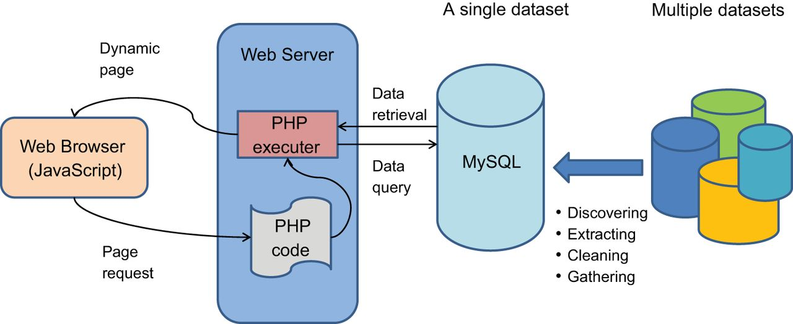
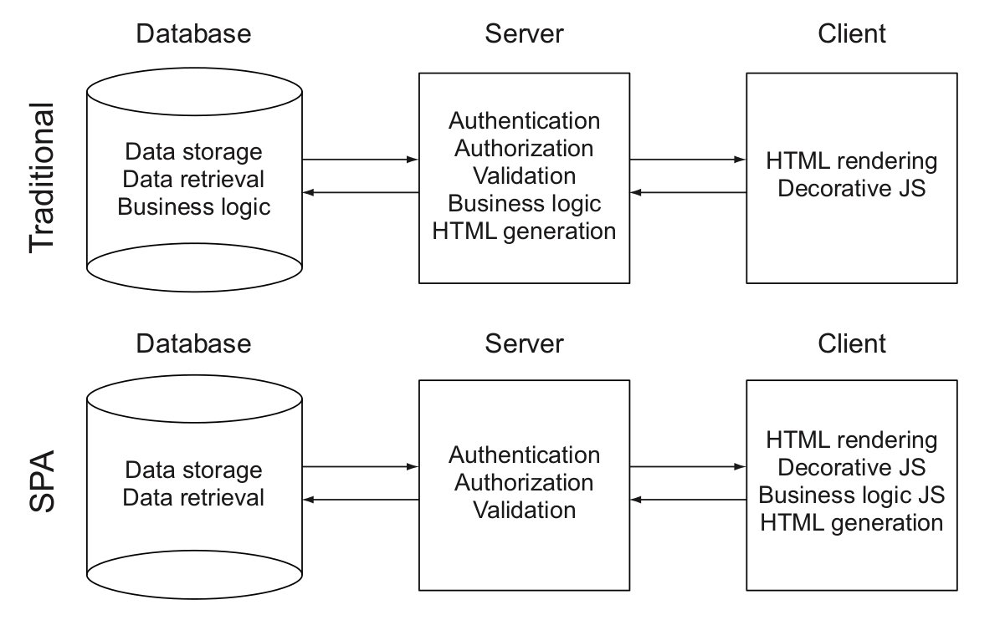
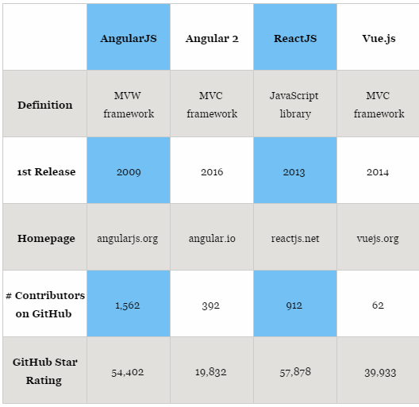

# Introducción al desarrollo Web

## Webapp vs páginas web
- ¿A medida?
- ¿Uso de software existente?
  - Moodle, Prestashop, Joomla, Wordpress...
- ¿Uso de frameworks?
  - Laravel, Django, Angular, React...

## Arquitecturas sistemas LAMP

- Normalmente usan programación web tradicional
  - Se pide una página al servidor
  - El servidor la envía
  - El navegador la renderiza

## Programación moderna

- Aplicaciones de una sola página (SPA).
- Se sirven todas las páginas a la vez:
  - Se renderizan directamente desde el navegador
  - La navegación entre páginas es inmediata
- El servidor provee una **API** que se consulta de modo asíncrono
- Tiempo de respuesta muy rápido (ideal para aplicaciones de escritorio)

## Áreas de desarrollo

 

## Lenguaje en servidor

- El lenguaje en el servidor es variable: 
  - nodeJS
  - Ruby
  - Python
  - PHP
  - ...

## Lenguaje en cliente

- Siempre es JavaScript
  - A veces se utilizan otros lenguajes (TypeScript, Elm...) y se compilan posteriormente a JavaScript
  - Otra opción es usar el nuevo estándar de JavaScript : 
    - ES6 y ES7 
    - Usar un transpiler: Babel, "el nuevo jQuery"
  - Automatizamos todo mediante task managers: Grunt, Gulp, Webpack...

## Frameworks de JavaScript
- Los frameworks de JavaScript más usados son
  - React
  - Angular
  - Vue (lo usa el framework de PHP Laravel)

     